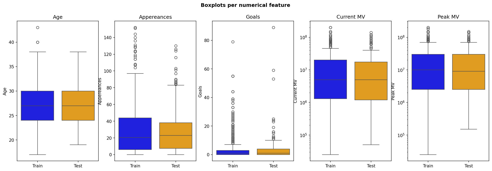
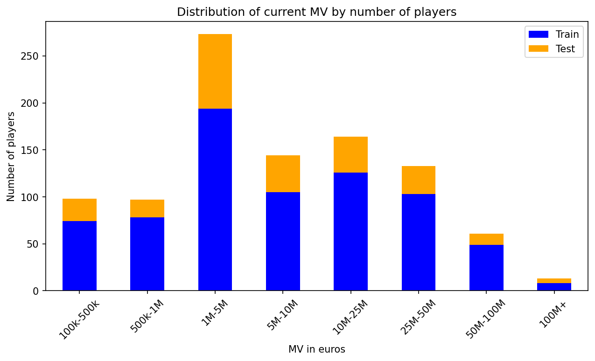
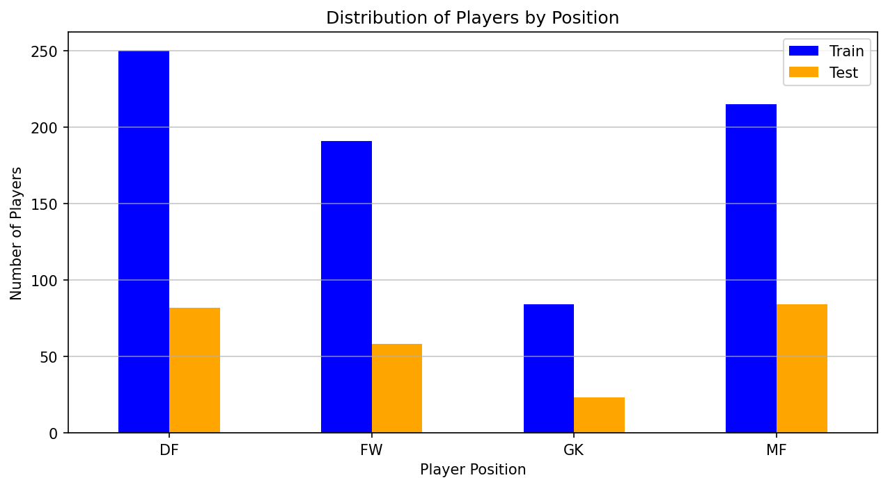
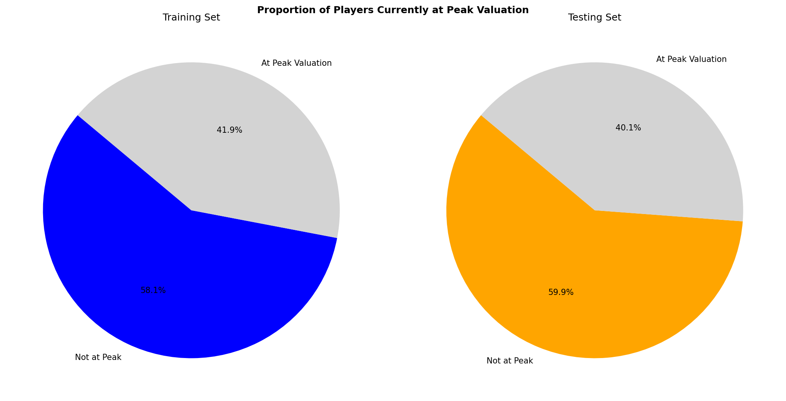
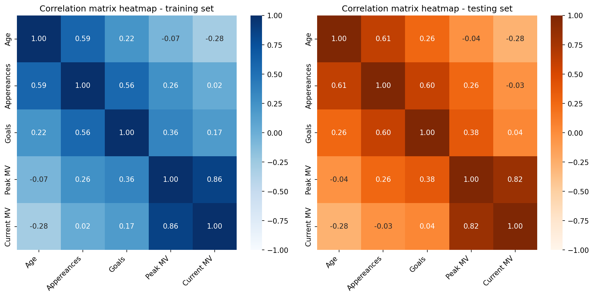
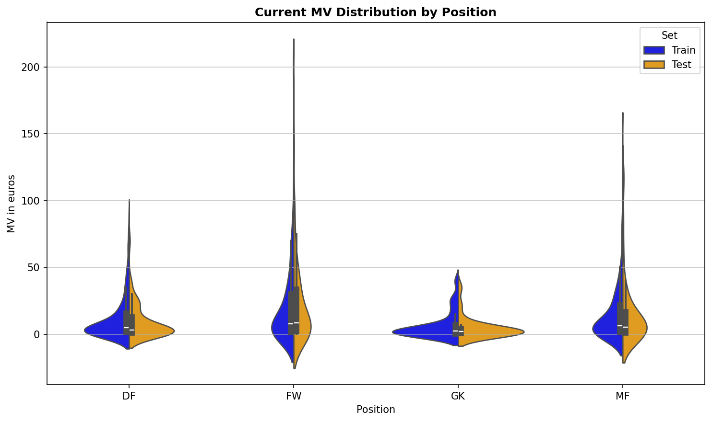
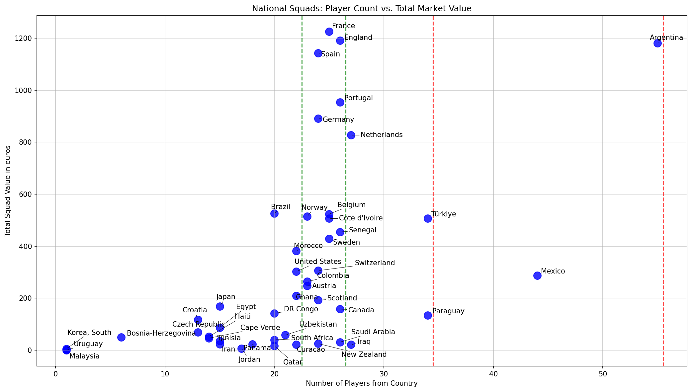
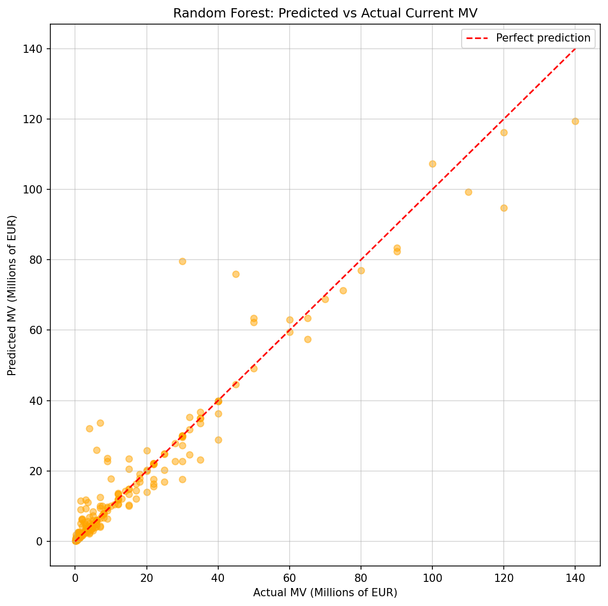

Dimitrescu Robert 312CA - Partea I
World Cup 2026 player value prediction
## 0. Pachete folosite pentru rulare cu venv (copy and paste), de asemenea nu am inclus player.csv in arhiva per cerintele temei. [Kaggle Dataset](https://www.kaggle.com/datasets/davidcariboo/player-scores?resource=download&select=players.csv):

adjustText==1.3.0
anyio==4.13.0
argon2-cffi==25.1.0
argon2-cffi-bindings==25.1.0
arrow==1.4.0
asttokens==3.0.1
async-lru==2.3.0
attrs==26.1.0
babel==2.18.0
beautifulsoup4==4.14.3
bleach==6.3.0
certifi==2026.5.20
cffi==2.0.0
charset-normalizer==3.4.7
comm==0.2.3
contourpy==1.3.3
cycler==0.12.1
debugpy==1.8.20
decorator==5.3.1
defusedxml==0.7.1
executing==2.2.1
fastjsonschema==2.21.2
fonttools==4.63.0
fqdn==1.5.1
h11==0.16.0
httpcore==1.0.9
httpx==0.28.1
idna==3.16
ipykernel==7.2.0
ipython==9.13.0
ipython_pygments_lexers==1.1.1
isoduration==20.11.0
jedi==0.20.0
Jinja2==3.1.6
joblib==1.5.3
json5==0.14.0
jsonpointer==3.1.1
jsonschema==4.26.0
jsonschema-specifications==2025.9.1
jupyter-events==0.12.1
jupyter-lsp==2.3.1
jupyter_client==8.8.0
jupyter_core==5.9.1
jupyter_server==2.18.2
jupyter_server_terminals==0.5.4
jupyterlab==4.5.7
jupyterlab_pygments==0.3.0
jupyterlab_server==2.28.0
kiwisolver==1.5.0
lark==1.3.1
lxml==6.1.1
MarkupSafe==3.0.3
matplotlib==3.10.9
matplotlib-inline==0.2.2
mistune==3.2.1
nbclient==0.10.4
nbconvert==7.17.1
nbformat==5.10.4
nest-asyncio==1.6.0
notebook==7.5.6
notebook_shim==0.2.4
numpy==2.4.6
packaging==26.2
pandas==3.0.3
pandocfilters==1.5.1
parso==0.8.7
pexpect==4.9.0
pillow==12.2.0
platformdirs==4.9.6
prometheus_client==0.25.0
prompt_toolkit==3.0.52
psutil==7.2.2
ptyprocess==0.7.0
pure_eval==0.2.3
pycparser==3.0
Pygments==2.20.0
pyparsing==3.3.2
python-dateutil==2.9.0.post0
python-json-logger==4.1.0
PyYAML==6.0.3
pyzmq==27.1.0
referencing==0.37.0
requests==2.34.2
rfc3339-validator==0.1.4
rfc3986-validator==0.1.1
rfc3987-syntax==1.1.0
rpds-py==0.30.0
scikit-learn==1.8.0
scipy==1.17.1
seaborn==0.13.2
Send2Trash==2.1.0
setuptools==82.0.1
six==1.17.0
soupsieve==2.8.4
stack-data==0.6.3
tabulate==0.10.0
terminado==0.18.1
threadpoolctl==3.6.0
tinycss2==1.4.0
tornado==6.5.6
traitlets==5.15.0
typing_extensions==4.15.0
tzdata==2026.2
uri-template==1.3.0
urllib3==2.7.0
wcwidth==0.7.0
webcolors==25.10.0
webencodings==0.5.1
websocket-client==1.9.0

## 1. Tipul problemei
Regresie — modelul prezice care este valoarea curenta a jucatorilor care vor juca la cupa mondiala din 2026 (market value).

## 2. Construcția dataset-ului
Am preluat date din doua surse, prima incadrandu se in " Web scraping / API-uri publice " si cea de a doua in " Extindere sau combinare de dataset-uri existente":

Wikipedia (2026 FIFA World Cup squads) — folosing pandas.read_html extragem coloanele: 
* official appearances a player has made for the national team
* for what club they play
* age
* name
* position

Kaggle Player Scores (Transfermarkt) cu download pe sistem local, facem match numai pe jucatorii extrasi din wikipedia deja si adaugam pentru fiecare:
* player country
* current market value
* preak market value
* boolean check if a player is in his prime

## 3. Structura subseturilor
* Train: 740 linii
* Test: 247 linii
* Avem 10 coloane (features) + inca o coloana pe care o folosim drept target

|   Coloane           | Tipuri        |
|:------------|:---------|
| Player      | object   |
| Position    | category |
| Age         | int64    |
| Appereances | int64    |
| Goals       | int64    |
| Club        | category |
| Club League | category |
| Country     | category |
| Current MV  | int64    |
| Peak MV     | int64    |
| Apex MV     | bool     |

|     | Player                   | Position   |   Age |   Appereances |   Goals | Club                     | Club League   | Country            |   Current MV |   Peak MV | Apex MV   |
|----:|:-------------------------|:-----------|------:|--------------:|--------:|:-------------------------|:--------------|:-------------------|-------------:|----------:|:----------|
|   0 | Vladimír Coufal          | DF         |    33 |            61 |       2 | TSG Hoffenheim           | L1            | Czech Republic     |      2700000 |  12000000 | False     |
|   1 | David Zima               | DF         |    25 |            24 |       1 | Slavia Prague            | TS1           | Czech Republic     |      7000000 |   7500000 | False     |
|   2 | Jaroslav Zelený          | DF         |    33 |            21 |       0 | Sparta Prague            | TS1           | Czech Republic     |       600000 |   1500000 | False     |
|   3 | David Jurásek            | DF         |    25 |            16 |       1 | Slavia Prague            | TS1           | Czech Republic     |      5000000 |   8000000 | False     |
|   4 | Tomáš Souček             | MF         |    31 |            89 |      17 | West Ham United          | GB1           | Czech Republic     |     12000000 |  45000000 | False     |
|   5 | Vladimír Darida          | MF         |    35 |            78 |       8 | Hradec Králové           | TS1           | Czech Republic     |       375000 |  10000000 | False     |
|   6 | Michal Sadílek           | MF         |    27 |            33 |       1 | Slavia Prague            | TS1           | Czech Republic     |      8000000 |   8000000 | True      |
|   7 | Pavel Bucha              | MF         |    28 |             0 |       0 | FC Cincinnati            | MLS1          | Czech Republic     |      4000000 |   4000000 | True      |
|   8 | Alexandr Sojka           | MF         |    23 |             0 |       0 | Viktoria Plzeň           | TS1           | Czech Republic     |      2300000 |   2300000 | True      |
|   9 | Patrik Schick            | FW         |    30 |            52 |      25 | Bayer Leverkusen         | L1            | Czech Republic     |     20000000 |  50000000 | False     |
...
| 983 | Carlos Harvey            | MF         |    26 |            25 |       2 | Minnesota United FC      | MLS1          | Panama             |       600000 |    600000 | True      |
| 984 | Azarias Londoño          | MF         |    24 |            10 |       0 | Universidad Católica     | Unkown        | Panama             |      1200000 |   1200000 | True      |
| 985 | Ismael Díaz              | FW         |    29 |            54 |      17 | León                     | MEX1          | Panama             |      1800000 |   2000000 | False     |
| 986 | Tomás Rodríguez          | FW         |    27 |            11 |       3 | Saprissa                 | Unkown        | Panama             |      1000000 |   1000000 | True      |

## 4. Salvare CSV
Am salvat subseturile sub forma de CSV in test.csv si train.csv

## 5. Contributia proprie
Informatiile despre fiecare jucator din cupa mondiala impreuna cu features-ruile pe care le-am adaugat nu pot fi gasite pe net atltundeva. Ce am adaugat:
* am curatat valorile numerice din age sa fie in format de numar si nu string
* pentru coloana 'Player' am lasat doar nuemele jucatorului
* am redefinit tipurile tuturor obiectelor
* am normalizat numele unor tari care nu mai exista pentru jucatori mai in varsta
* am adaugat o coloana noua care verifica daca un jucator e in prime-ul lui
* am umplut valorile lipsa pentru jucatori fara club
* am eliminat valorile lipsa din restul coloanelor

## 6. Analiza exploratorie a datelor (EDA) complex

Toate observatiile mele despre date se afla in notebook. Am decis sa nu mai dau paste aici deoarece as repeta markdown-ul din notebook si ar fi clutered.

### 6.a Analiza valorilor lipsa inainte de inlocuire
|             |   Number missing |   Procent missing |
|:------------|-----------------:|------------------:|
| Player      |                0 |            0      |
| Position    |                0 |            0      |
| Age         |                0 |            0      |
| Appereances |                0 |            0      |
| Goals       |                0 |            0      |
| Club        |                0 |            0      |
| Club League |              398 |           31.1912 |
| Country     |              273 |           21.395  |
| Current MV  |              289 |           22.6489 |
| Peak MV     |              289 |           22.6489 |

### 6.b Statistici descriptive
Test set data dimension: (247, 10)
Training set data dimension: (740, 10)

Part I : X numerical values for training and testing comparison:

X_train numerical statistics:
|       |       Age |   Appereances |     Goals |         Peak MV |
|:------|----------:|--------------:|----------:|----------------:|
| count | 740       |      740      | 740       |   740           |
| mean  |  26.9878  |       28.5635 |   3.47838 |     2.07927e+07 |
| std   |   4.11389 |       27.9076 |   7.46654 |     2.77643e+07 |
| min   |  17       |        0      |   0       | 25000           |
| 25%   |  24       |        6      |   0       |     2.5e+06     |
| 50%   |  27       |       20.5    |   1       |     1e+07       |
| 75%   |  30       |       44      |   3       |     3e+07       |
| max   |  43       |      152      |  79       |     2e+08       |

X_test numerical statistics:
|       |       Age |   Appereances |     Goals |          Peak MV |
|:------|----------:|--------------:|----------:|-----------------:|
| count | 247       |      247      | 247       |    247           |
| mean  |  27       |       28.3239 |   3.49798 |      2.08099e+07 |
| std   |   4.04949 |       26.3985 |   8.39564 |      2.82257e+07 |
| min   |  19       |        0      |   0       | 150000           |
| 25%   |  24       |        7.5    |   0       |      2.5e+06     |
| 50%   |  27       |       23      |   1       |      9e+06       |
| 75%   |  30       |       38      |   4       |      3e+07       |
| max   |  38       |      130      |  89       |      1.5e+08     |

Part II : X non_numerical values for training and testing comparison:

X_train non_numerical statistics:
|        | Position   | Club           | Club League   | Country   |   Apex MV |
|:-------|:-----------|:---------------|:--------------|:----------|----------:|
| count  | 740        | 740            | 740           | 740       |       740 |
| unique | 4          | 327            | 32            | 45        |         2 |
| top    | DF         | Crystal Palace | GB1           | Argentina |         0 |
| freq   | 250        | 12             | 121           | 43        |       430 |

X_test non_numerical statistics:
|        | Position   | Club     | Club League   | Country   |   Apex MV |
|:-------|:-----------|:---------|:--------------|:----------|----------:|
| count  | 247        | 247      | 247           | 247       |       247 |
| unique | 4          | 173      | 26            | 44        |         2 |
| top    | MF         | Al-Nassr | GB1           | Argentina |         0 |
| freq   | 84         | 5        | 38            | 12        |       148 |

Part III : Y values for training and testing comparison:

y_train statistics:
|       |   Current MV |
|:------|-------------:|
| count |          740 |
| mean  |     14776182 |
| std   |     22642161 |
| min   |        25000 |
| 25%   |      1300000 |
| 50%   |      5000000 |
| 75%   |     20000000 |
| max   |    200000000 |

y_test statistics:
|       |   Current MV |
|:------|-------------:|
| count |          247 |
| mean  |     14037753 |
| std   |     22503640 |
| min   |        50000 |
| 25%   |      1200000 |
| 50%   |      5000000 |
| 75%   |     17500000 |
| max   |    140000000 |

### 6.c Analiza distributiei variabilelor 

### 6.d Detectarea outlierilor

### 6.e Analiza corelatiilor

### 6.f Analiza relatiilor cu variabila tintă

### 6.g Comentarii si interpretări personale
Avem markdown detailat pentru fiecare celula si explicat mai in detaliu decat in README + comments in cod.

## 7. Antrenarea și evaluarea modelului

Preprocesare: one-hot encoding pentru Position, Club, Club League, Country. Avem problema ca modedelul nu poate privii obiecte/string uri cum le privim noi asa ca le transformam valorile in numere cu care poate lucra mult mai usor. Restul valorilor sunt numere deci nu avem probleme.

Model ales: RandomForestRegressor (n_estimators=200, random_state=42). Am ales acest model deoarece fata de regresia lineara simpla modelul se descurca foarte bine cu outliers (precum jucatorul nostru de 200M).

Rezultate pe setul de test:
RMSE: 6,086,166 EUR
MAE:  2,503,894 EUR
R²:   0.9266

Interpretare: 

* R^2 ne arata ca modelul are o rata de aproximare de 92% pentru valoarea jucatorilor din piata si este un rezultat suficient de bun considerand setul nostru de date.
* MAE indica devierea in medie da la valoarea actuala cu 2.5 milioane de euro fata de valoarea reala.
* RMSE indica faptul ca pentru jucatorii foarte valorosi care sunt definite outliers pretul lor este subestimat. Accest lucru se intampla deoarce majoritatea jucatorilor nostrii se incadreaza intre 0 - 25 M de euro.
* Cel mai important factor de predicite a fost PEAK_MV deoarce valorile jucatorilor nu tind sa abata prea mult de la valoarea lor maxima inregistrata.

